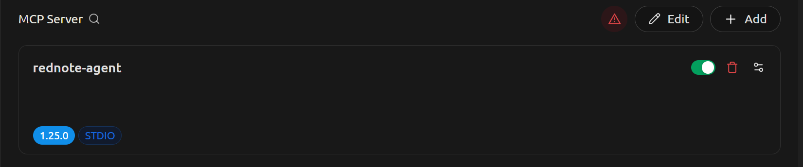

# MCP: "rednote" assistant
MCP server which collects data from www.xiaohongshu.com social media


[](https://www.cherry-ai.com/)
[](https://www.xiaohongshu.com/explore)


## Acknowledgement

[xhshow](https://github.com/Cloxl/xhshow) (modified)


## Install

### Cookies extraction tool

If you have [Chromium-based browsers](https://en.wikipedia.org/wiki/Chromium_(web_browser)#Browsers_based_on_Chromium), please install [J2TEAM cookies](https://chromewebstore.google.com/detail/j2team-cookies/okpidcojinmlaakglciglbpcpajaibco) extension. Otherwise, you need to find an alternative extension to export, or manually copy cookies to local file.

>   [!NOTE]
>
>   Format of extracted cookies is described by JSON schema `cookies_schema.json`.
>
>   If you don't use J2TEAM cookies, you can use [JSON schema editor](https://github.com/cloudy-sfu/JSON-schema-editor) to check whether the extracted cookies have the same format. Open `cookies_schema.json` (template) and validate the extracted cookies (instances).

### Python program

Create and a Python 3.13 virtual environment and activate. Run the following command.

```
pip install -r requirements.txt
python install_cherry_studio_windows.py
```

Save the output before closing, because the output is MCP configuration information.

### Extract "rednote" cookies

Confirm you have a [rednote](www.xiaohongshu.com) account.

Visit https://www.xiaohongshu.com and log in your "rednote" account.

Export the cookies with J2TEAMS Cookies or alternatives.

Copy the absolute path of the created cookies file to MCP configuration, after `xiaohongshu_cookies_path=` in environment variables.


### Cherry studio

Confirm you have Cherry Studio (version 1.7.8 or above), and already have access to any large language models via API key.

In cherry studio, go to "settings > MCP servers". (You don't need to open the warning symbol and install "uv" and "bun".)


Click "Add" to create a new MCP server. Fill the form with the information from the output of Python program mentioned above (temporarily saved in a text file).


Fill MCP server form with MCP configuration information mentioned above.

### Update version

In MCP servers settings, turn off and on "rednote-assistant" MCP server.

In conversation MCP server tab, clear and redo clicking "rednote-assistant"MCP server.


## Usage

In Cherry Studio, go to "Settings > MCP servers" page, enable "rednote-assistant" MCP server that you installed.


>   [!Caution]
>
>   Don't use the "enable" button in MCP server list.
>
>   According to the behavior Cherry Studio v1.7.8, ths button will enable MCP server anyway even if the server fails.
>
>   


Start a new conversation with any large language model which supports MCP servers.

Enable "rednote-assistant" MCP server.

>   [!WARNING]
>
>   In some large language models, MCP servers conflict with the model's built-in web search function.


Input "/mcp" in the message box and select "MCP Prompts".


Select `rednote_assistant_general_workflow`. The text will be generated to the message box.


Remove `/**User:** ` prefix. The remaining part tells large language models how to use "rednote-assistant" MCP server.

Send this message to the large language model. If you would like letting large language model know the workflow persistently and automatically, append it to your assistant role prompt.

>   [!NOTE]
>
>   **Edit assistant role prompt**
>
>   In the conversation page, click "Assistants" tab and "Add Assistant". Select type "Assistant".
>
>   Go to "Prompt Settings" tab and config as follows.
>
>   Input the prompt mentioned above to "Prompt" field and save.
>
>   
>
>   

### Maintain cookies

The "rednote" cookies will be invalidated by "rednote" website from time to time. If you find MCP tools have problems because of invalid cookies, update as follows.

Follow the instruction in "Install > Extract rednote cookies" and update the value of `xiaohongshu_cookies_path` in MCP server config to the path of new cookies file.

In MCP servers settings, turn off and on "rednote-assistant" MCP server.

In conversation MCP server tab, clear and redo clicking "rednote-assistant"MCP server.

