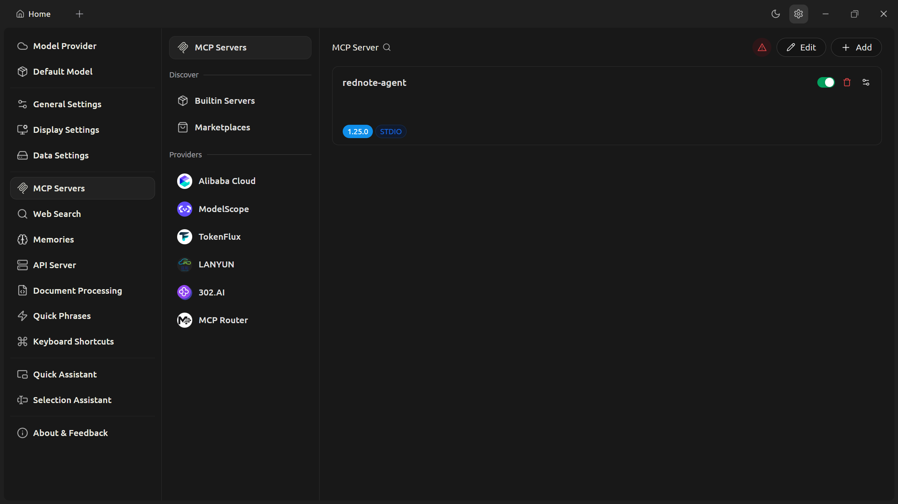
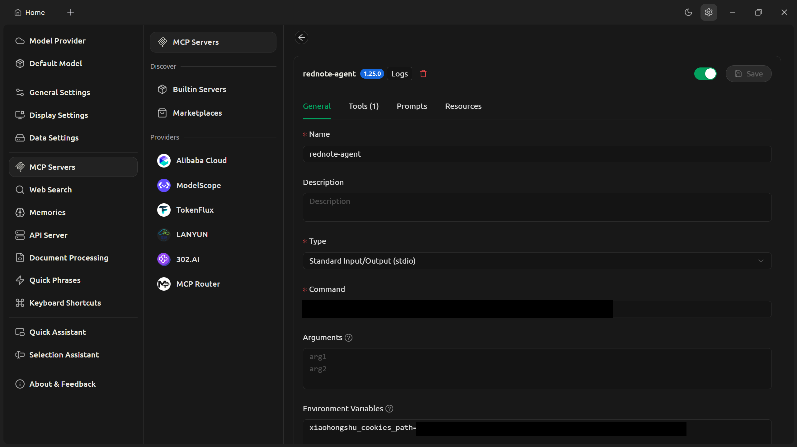
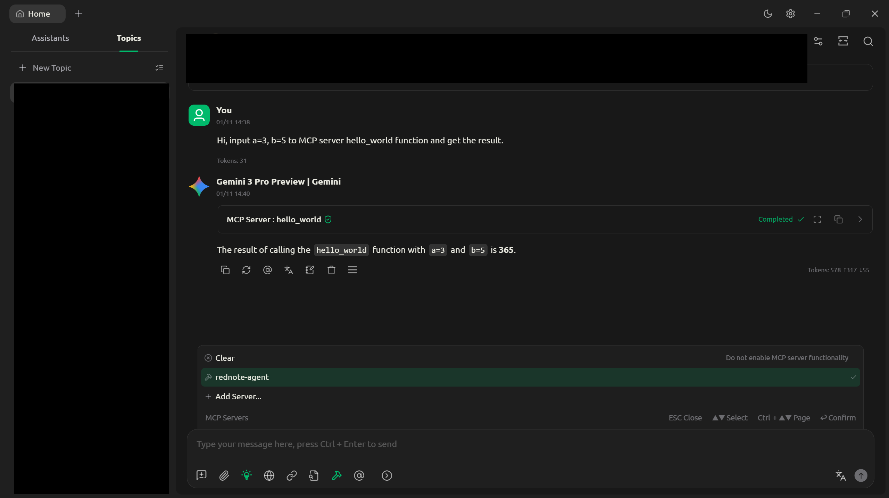
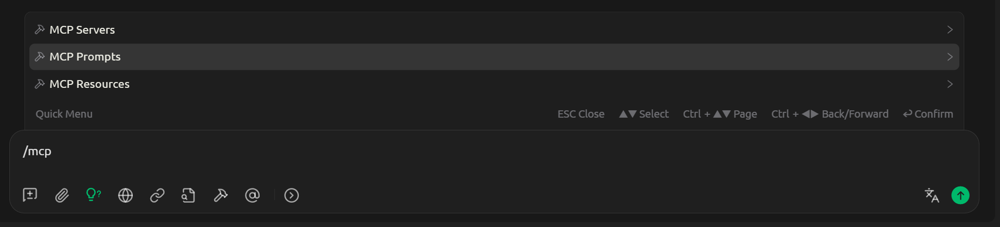
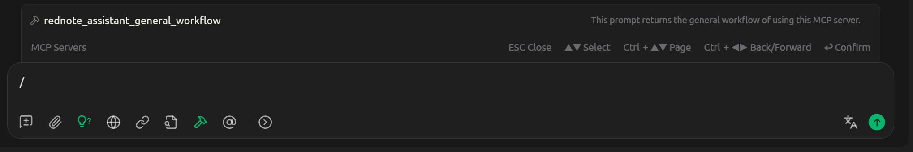
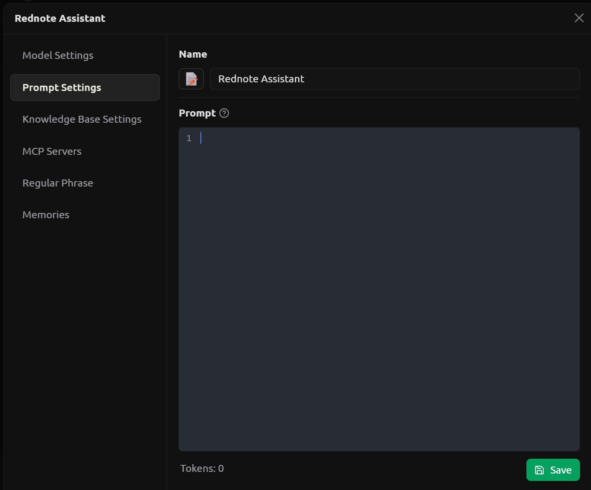

# MCP: "rednote" assistant
MCP server which collects data from www.xiaohongshu.com social media


[](https://www.cherry-ai.com/)
[](https://www.xiaohongshu.com/explore)


## Acknowledgement

[xhshow](https://github.com/Cloxl/xhshow) (modified)


## Install

### Cookies extraction tool

If you have [Chromium-based browsers](https://en.wikipedia.org/wiki/Chromium_(web_browser)#Browsers_based_on_Chromium), please install [J2TEAM cookies](https://chromewebstore.google.com/detail/j2team-cookies/okpidcojinmlaakglciglbpcpajaibco) extension. Otherwise, you need to find an alternative extension to export, or manually copy cookies to local file.

>   [!NOTE]
>
>   If you don't use Chromium-based browsers or prefer another way to extract the cookies (alternative extension or manual process), the format of extracted cookies file is defined in JSON schema `cookies_schema.json`.
>
>   [JSON schema editor](https://github.com/cloudy-sfu/JSON-schema-editor) can check whether the extracted cookies file (instance) fits `cookies_schema.json` (template).

### Python program

Confirm you have a [rednote](www.xiaohongshu.com) account.

Visit https://www.xiaohongshu.com and log in your "rednote" account.

Export the cookies with J2TEAMS Cookies or alternatives to file `$xiaohongshu_cookies_path`.

Create and a Python 3.13 virtual environment and activate. Run the following command.

```
pip install -r requirements.txt
python install_cherry_studio_windows.py
python cookies.py --input_path $xiaohongshu_cookies_path
```

Save the output before closing, because the output is MCP configuration information.

### Cherry studio

Confirm you have Cherry Studio (version 1.7.8 or above), and already have access to any large language models via API key.

In cherry studio, go to "Settings > MCP servers" (no need of "uv" and "bun").



<div id="fig-1">
    <i>Figure 1. MCP server list page</i>
</div>

Click "Add" to create a new MCP server. Fill the form with the information from the output of [Python program](#python-program).



<div id="fig-2">
    <i>Figure 2. MCP server config page</i>
</div>

### Update version

To update this program,

1.   In [MCP server config](#fig-2), turn off and on "rednote-assistant" MCP server. 

2.   In [conversation MCP server list](#fig-3), clear and re-select it.


## Usage

In Cherry Studio, go to [MCP server config page](#fig-2), enable "rednote-assistant" MCP server.

>   [!Caution]
>
>   Don't use the "enable" button in [MCP server list](#fig-1).
>
>   According to the behavior Cherry Studio v1.7.8, this button will enable MCP server anyway even if the server fails.
>

Start a new conversation and choose any model which supports MCP servers.

Enable "rednote-assistant" MCP server.




<div id="fig-3">
    <i>Figure 3. Conversation MCP server list</i>
</div>

>   [!WARNING]
>
>   In some large language models, MCP servers conflict with the model's built-in web search function.


Input `/mcp` in the message box and select "MCP Prompts".



<div id="fig-4">
    <i>Figure 4. Conversation MCP functions</i>
</div>

Select `rednote_assistant_general_workflow`. The text will be generated to the message box.



<div id="fig-5">
    <i>Figure 5. MCP prompts</i>
</div>

Remove `/**User:** ` prefix. The remaining part tells models how to use "rednote-assistant" MCP server.

To use MCP server temporarily in an existed conversation, send this message in the conversation.

To let the model knows the workflow persistently, create a new assistant and append it to the role prompt as follows.

>   [!NOTE]
>
>   **Edit assistant role prompt**
>
>   In the conversation page, click "Assistants" tab and "Add Assistant". Select type "Assistant".
>
>   Go to "Prompt Settings" tab.
>
>   Input the prompt mentioned above to "Prompt" field and save.
>
>   
>
>   <div id="fig-6">
>       <i>Figure 6. Role prompt page</i>
>   </div>

### Maintain cookies

If MCP server fails to start, go to [MCP server config page](#fig-2) and click "Logs" to find the reason. If the cookies expires or is invalidated by the website, update the cookies as follows.

Extract the new cookies to file `$xiaohongshu_cookies_path`. 

Go to this program's folder, activate Python virtual environment. 

Run the following command.

```
python cookies.py --input_path $xiaohongshu_cookies_path
```

Do the same action as [updating version](#update-version).

