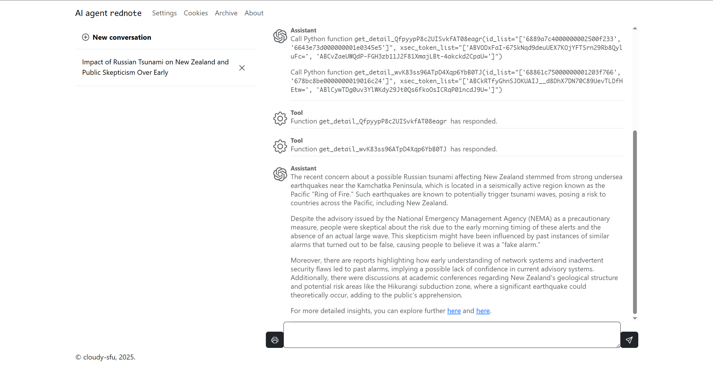

# AI agent `rednote`
 AI agent for [www.xiaohongshu.com](http://www.xiaohongshu.com/) thread


[](https://platform.openai.com/docs/overview)
[](https://www.xiaohongshu.com/explore)




## Acknowledgement

[xhshow](https://github.com/Cloxl/xhshow) (modified)

## Install

Make sure you have a [rednote](https://www.xiaohongshu.com) social media account.

Create and activate a Python 3.12 virtual environment. Set the current directory to the program's root directory. Run the following command.

```
pip install -r requirements.txt
```


If you have [Chromium-based browsers](https://en.wikipedia.org/wiki/Chromium_(web_browser)#Browsers_based_on_Chromium), please install [J2TEAM cookies](https://chromewebstore.google.com/detail/j2team-cookies/okpidcojinmlaakglciglbpcpajaibco) extension. Otherwise, you need to find an alternative extension or manually copy any website's cookies from browser.

> [!NOTE]
>
> Function `auth.dump_cookies` is designed to load J2TEAM output files. If you use an alternative extension or manually paste the cookies, you need to modify this function, because pasted cookies table is in different format.
>
> The output table of `auth.dump_cookies` must have the following columns at least:
>
> - `name`
> - `value`
> - `expirationDate`  the expiry date of this cookies item
>
> Other columns are ignored.
>
> The output table must be saved in CSV format.


Get an OpenAI API key for a model which supports [function calling](https://platform.openai.com/docs/guides/function-calling?api-mode=chat), for example `gpt-4o`. This program calls `gpt-4o` by default if not customized.

## Usage

Activate a Python 3.12 virtual environment. 

Set the current directory to the program's root directory. 

Run the following command.

```
python app.py
```

In the popped-up web page, 

- Navigate to "Settings" page. Fill in OpenAI API key and choose the model.
- Navigate to "Cookies" page. Upload `rednote` cookies following the instruction.
- Go back to home page and start chatting.

